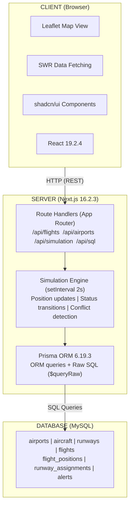
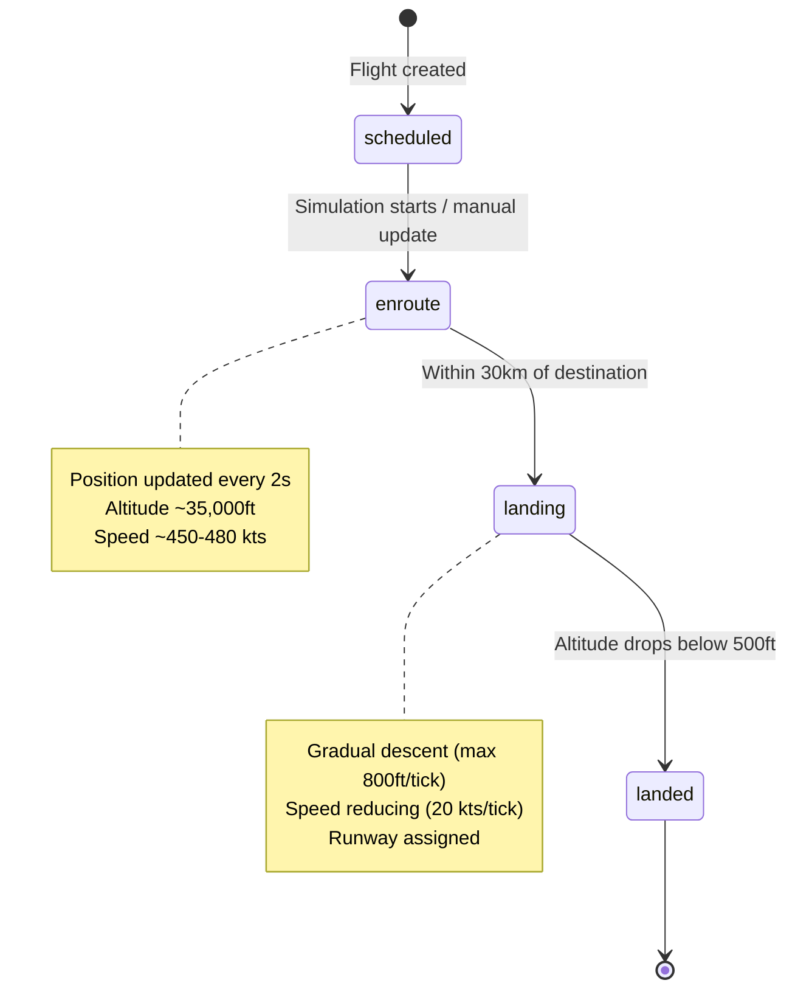
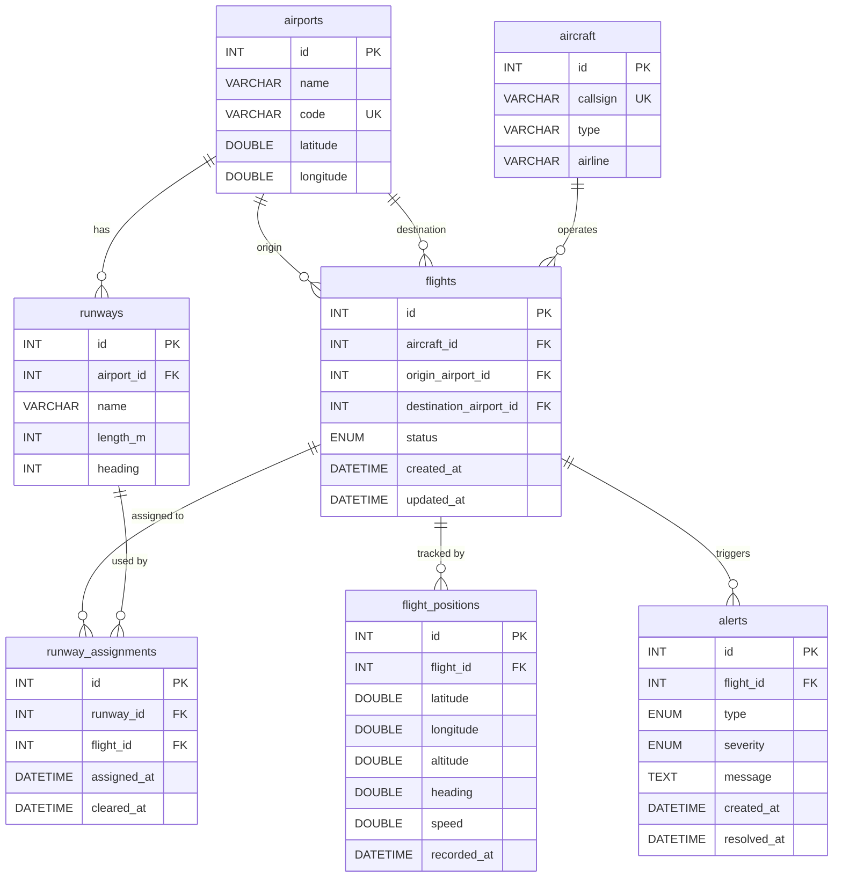
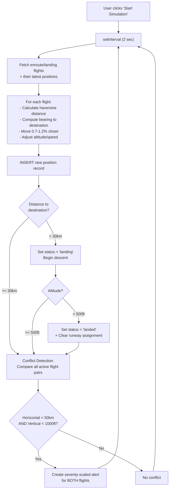

# Delhi Technological University
## Department of Computer Science and Engineering

---

### CS210 DBMS LAB FILE

**Submitted By**
Anant Singhal (24/CS/056),
Anant Chaudhary (24/CS/055)

**Submitted To**
Dr. Minni Jain

---

## Table of Contents

1. [Project Overview](#1-project-overview)
2. [System Description](#2-system-description)
3. [Functional Requirements](#3-functional-requirements)
4. [Database Design](#4-database-design)
5. [Non-Functional Requirements](#5-non-functional-requirements)
6. [Output Section](#6-output-section)
7. [Assumptions and Constraints](#7-assumptions-and-constraints)
8. [Conclusion](#8-conclusion)

---

## 1. Project Overview

### Project Introduction

Beluga is a high-performance, web-based Air Traffic Control (ATC) simulator designed to demonstrate real-time data management, complex relational queries, and live simulation of dynamic systems. By providing a centralized control tower dashboard, this system transforms raw flight telemetry data into an interactive, data-driven visualization of airspace management.

### The Problem Landscape

In real-world air traffic control, managing flight data involves handling:

- **High-Frequency Inserts:** Aircraft positions are recorded every few seconds, generating thousands of rows in short timeframes.
- **Complex Relationships:** Flights connect aircraft to airports, runways, and safety alerts through multiple foreign key chains.
- **Real-Time State Queries:** The system must always know the *latest* position of every aircraft, not its entire history, requiring efficient "latest record per group" queries.
- **Conflict Detection:** Pairwise comparison of all active flights to detect dangerous proximity in both horizontal distance and vertical separation.

### Solution & Purpose

Beluga addresses these challenges by offering a single point of truth for airspace state. The purpose of this system is to:

- **Simulate Flight Lifecycles:** Track a flight from its scheduled departure through enroute, landing, and landed states with realistic position updates.
- **Enforce Safety Constraints:** Utilize runway occupancy checks, foreign key constraints, and application-level validation to ensure data integrity at every step.
- **Demonstrate Advanced SQL:** Showcase subqueries, self-joins, aggregate functions, conditional counting (`CASE WHEN`), custom sorting (`FIELD()`), transactions, and raw SQL alongside ORM-generated queries.

### Core High-Level Features

| Feature | Description |
|---|---|
| Real-Time Flight Map | Interactive Leaflet.js map with moving aircraft icons, color-coded by flight status, updating every 2 seconds |
| Runway Assignment Engine | Assign incoming flights to available runways, enforce single-occupancy rules, and clear runways upon landing |
| Conflict Detection System | Automatic pairwise proximity checks with severity-scaled alerts (critical, high, medium, low) |
| Operations Analytics Dashboard | Aggregate queries showing flight distributions, airport throughput, runway utilization, airline statistics, and alert resolution rates |
| SQL Query Editor | A built-in IDE with syntax highlighting, query templates, execution history, and direct database access |
| Full CRUD Management | Create, read, update, and delete operations for airports, aircraft, flights, and runways with transactional safety |

---

## 2. System Description

### Technical Architecture

The system is built on a modern **Full-Stack Architecture** using Next.js, which unifies the frontend and backend into a single deployable application. The UI layer (React), the API layer (Next.js Route Handlers), and the data layer (MySQL via Prisma ORM) are all integrated within one framework, enabling server-side rendering, API co-location, and type-safe database access.



### Frontend Tier (The UI)

| Aspect | Details |
|---|---|
| Technology | React 19.2.4 with Next.js 16.2.3 |
| Role | Primary interface for the air traffic controller |
| Data Fetching | SWR (Stale-While-Revalidate) with configurable refresh intervals |
| Mapping | Leaflet.js 1.9.4 with react-leaflet 5.0.0, CartoDB Dark tiles |
| Components | shadcn/ui (Radix UI primitives + Tailwind CSS) |

**SWR Polling Intervals:**

| Data | Endpoint | Refresh Interval |
|---|---|---|
| Flight Positions | `/api/positions/latest` | 2 seconds |
| Alerts | `/api/alerts` | 3 seconds |
| Flights | `/api/flights` | 5 seconds |
| Runways | `/api/runways` | 5 seconds |
| Simulation Status | `/api/simulation/status` | 5 seconds |

### Backend Tier (The Logic)

| Aspect | Details |
|---|---|
| Technology | Next.js 16.2.3 Route Handlers (App Router) |
| Role | API routing, business logic, constraint enforcement |
| Simulation | Server-side `setInterval` timer, ticking every 2 seconds |
| Transactions | Prisma `$transaction` for multi-step atomic operations |

### Database Tier (The Data)

| Aspect | Details |
|---|---|
| Technology | MySQL |
| Interface | Prisma 6.19.3 ORM |
| Tables | 7 tables, 2 enum types |
| Query Methods | Prisma ORM (CRUD) + Raw SQL (analytics, positions, conflicts) |

### Development Environment

| Tool | Version/Details |
|---|---|
| Language | TypeScript 5 |
| Framework | Next.js 16.2.3 (React 19.2.4) |
| Package Manager | pnpm |
| Styling | Tailwind CSS 4 with oklch color system |
| Icons | Lucide React 1.8.0 |
| Data Fetching | SWR 2.4.1 |
| Maps | Leaflet 1.9.4 + react-leaflet 5.0.0 |
| UI Components | shadcn/ui 4.2.0 |

---

## 3. Functional Requirements

### Administrative Functions

#### Airport & Runway Management

| Req ID | Description |
|---|---|
| REQ-ADD-AIRPORT | Allow users to register new airports by capturing Name, IATA Code, Latitude, and Longitude |
| REQ-UPDATE-AIRPORT | Allow modification of airport metadata (e.g., correcting coordinates or renaming) |
| REQ-DELETE-AIRPORT | Allow removal of airport records only when no flights reference the airport, cascading deletion to runways and their assignments |
| REQ-ADD-RUNWAY | Allow adding runways to airports, specifying Name (e.g., "09/27"), Length (meters), and Heading (degrees) |
| REQ-DELETE-RUNWAY | Block deletion of runways with active assignments |

#### Aircraft & Flight Management

| Req ID | Description |
|---|---|
| REQ-ADD-AIRCRAFT | Create aircraft records with a unique Callsign, Type (e.g., "Boeing 787-8"), and Airline |
| REQ-ADD-FLIGHT | Create flights linking an Aircraft to an Origin Airport and Destination Airport, with an initial status |
| REQ-FLIGHT-POSITION | Auto-generate an initial position record when a flight is created with enroute or landing status |
| REQ-DELETE-FLIGHT | Cascade-delete all child records (positions, runway assignments, alerts) within a transaction |

### Operational Functions

#### Simulation Engine

| Req ID | Description |
|---|---|
| REQ-SIM-START | Start a simulation that ticks every 2 seconds, advancing all enroute and landing flights |
| REQ-SIM-MOVEMENT | Calculate new positions using haversine distance, bearing formulas, and altitude/speed adjustments |
| REQ-SIM-LANDING | Auto-transition flights within 30km of destination to `landing` status with gradual descent |
| REQ-SIM-LANDED | Auto-transition flights with altitude below 500ft to `landed` and clear runway assignments |
| REQ-SIM-CONFLICTS | Perform pairwise conflict detection (50km horizontal, 1000ft vertical) and create severity-scaled alerts |

#### Runway Operations

| Req ID | Description |
|---|---|
| REQ-ASSIGN-RUNWAY | Verify runway is unoccupied and flight is enroute, then assign within a transaction |
| REQ-CLEAR-RUNWAY | Set `cleared_at` timestamp and update flight status to `landed` within a transaction |

#### Alert Management

| Req ID | Description |
|---|---|
| REQ-ALERTS-FEED | Display all unresolved alerts with severity badges, callsigns, and distance/separation details |
| REQ-RESOLVE-ALERT | Allow users to resolve alerts, setting the `resolved_at` timestamp |

#### Dashboard & Analytics

| Req ID | Description |
|---|---|
| REQ-DASH-MAP | Display a real-time interactive map with aircraft markers updated every 2 seconds |
| REQ-ANALYTICS-OVERVIEW | Show total counts, flight status distributions, and average positions per flight |
| REQ-ANALYTICS-ALERTS | Display breakdowns by severity and type, plus resolution rate statistics |
| REQ-ANALYTICS-AIRPORTS | Show departures vs arrivals per airport and runway utilization metrics |
| REQ-ANALYTICS-AIRLINES | Show aircraft counts and flight volumes per airline |

---

## 4. Database Design

### Relational Data Schema

The database is structured with **7 tables** across **2 enum types**, designed to minimize redundancy, enforce referential integrity, and support high-frequency inserts for position tracking.

| Table Name | Primary Key | Foreign Keys | Key Attributes |
|---|---|---|---|
| `airports` | `id` | None | `name`, `code` (UNIQUE), `latitude`, `longitude` |
| `aircraft` | `id` | None | `callsign` (UNIQUE), `type`, `airline` |
| `runways` | `id` | `airport_id` -> `airports` | `name`, `length_m`, `heading` |
| `flights` | `id` | `aircraft_id` -> `aircraft`, `origin_airport_id` -> `airports`, `destination_airport_id` -> `airports` | `status` (ENUM), `created_at`, `updated_at` |
| `flight_positions` | `id` | `flight_id` -> `flights` | `latitude`, `longitude`, `altitude`, `heading`, `speed`, `recorded_at` |
| `runway_assignments` | `id` | `runway_id` -> `runways`, `flight_id` -> `flights` | `assigned_at`, `cleared_at` (nullable) |
| `alerts` | `id` | `flight_id` -> `flights` | `type` (ENUM), `severity` (ENUM), `message`, `created_at`, `resolved_at` (nullable) |

---

### Table Structures & Sample Data

#### Table 1: `airports`

Stores every airport (name, 3-letter IATA code, and GPS coordinates).

```sql
CREATE TABLE airports (
    id        INTEGER NOT NULL AUTO_INCREMENT,
    name      VARCHAR(100) NOT NULL,
    code      VARCHAR(10) NOT NULL,
    latitude  DOUBLE NOT NULL,
    longitude DOUBLE NOT NULL,
    UNIQUE INDEX airports_code_key(code),
    PRIMARY KEY (id)
);
```

**Sample Data:**

| id | name | code | latitude | longitude |
|---|---|---|---|---|
| 1 | Indira Gandhi International | DEL | 28.5562 | 77.1000 |
| 2 | Chhatrapati Shivaji Maharaj | BOM | 19.0896 | 72.8656 |
| 3 | Kempegowda International | BLR | 13.1986 | 77.7066 |
| 4 | Netaji Subhas Chandra Bose | CCU | 22.6547 | 88.4467 |
| 5 | John F. Kennedy International | JFK | 40.6413 | -73.7781 |
| 6 | Heathrow | LHR | 51.4700 | -0.4543 |
| 7 | Dubai International | DXB | 25.2532 | 55.3657 |
| ... | ... | ... | ... | ... |

*(56 airports total covering India, US, Europe, Middle East, Asia)*

---

#### Table 2: `aircraft`

Stores every airplane (its callsign like "AI101", what type of plane, and which airline).

```sql
CREATE TABLE aircraft (
    id        INTEGER NOT NULL AUTO_INCREMENT,
    callsign  VARCHAR(20) NOT NULL,
    type      VARCHAR(50) NOT NULL,
    airline   VARCHAR(100) NOT NULL,
    UNIQUE INDEX aircraft_callsign_key(callsign),
    PRIMARY KEY (id)
);
```

**Sample Data:**

| id | callsign | type | airline |
|---|---|---|---|
| 1 | AI101 | Boeing 787-8 | Air India |
| 2 | 6E202 | Airbus A320neo | IndiGo |
| 3 | UK303 | Airbus A320-200 | Vistara |
| 4 | SG404 | Boeing 737-800 | SpiceJet |
| 5 | AI505 | Boeing 777-300ER | Air India |
| 6 | 6E606 | Airbus A321neo | IndiGo |
| 7 | UK707 | Boeing 787-9 | Vistara |
| 8 | SG808 | Boeing 737 MAX 8 | SpiceJet |

---

#### Table 3: `runways`

Each runway belongs to an airport. Has a name (like "09/27"), a length in meters, and a compass heading.

```sql
CREATE TABLE runways (
    id         INTEGER NOT NULL AUTO_INCREMENT,
    airport_id INTEGER NOT NULL,
    name       VARCHAR(20) NOT NULL,
    length_m   INTEGER NOT NULL,
    heading    INTEGER NOT NULL,
    PRIMARY KEY (id)
);
```

**Sample Data (Delhi Airport):**

| id | airport_id | name | length_m | heading |
|---|---|---|---|---|
| 1 | 1 (DEL) | 09/27 | 3810 | 90 |
| 2 | 1 (DEL) | 10/28 | 4430 | 100 |
| 3 | 1 (DEL) | 11/29 | 2813 | 110 |

---

#### Table 4: `flights`

A flight connects one aircraft to an origin airport and a destination airport. Status changes over time: `scheduled` -> `enroute` -> `landing` -> `landed`.

```sql
CREATE TABLE flights (
    id                     INTEGER NOT NULL AUTO_INCREMENT,
    aircraft_id            INTEGER NOT NULL,
    origin_airport_id      INTEGER NOT NULL,
    destination_airport_id INTEGER NOT NULL,
    status                 ENUM('scheduled', 'enroute', 'landing', 'landed') NOT NULL DEFAULT 'scheduled',
    created_at             DATETIME(3) NOT NULL DEFAULT CURRENT_TIMESTAMP(3),
    updated_at             DATETIME(3) NOT NULL,
    INDEX flights_status_idx(status),
    PRIMARY KEY (id)
);
```

**Enum: `FlightStatus`**

| Value | Meaning |
|---|---|
| `scheduled` | Flight is planned but has not departed |
| `enroute` | Flight is in the air, moving toward destination |
| `landing` | Flight is within 30km of destination, descending |
| `landed` | Flight has touched down (altitude < 500ft) |

**Flight Status State Diagram:**



**Sample Data:**

| id | aircraft_id | origin | destination | status | created_at |
|---|---|---|---|---|---|
| 1 | 1 (AI101) | 2 (BOM) | 1 (DEL) | enroute | 2026-04-20 10:00:00 |
| 2 | 2 (6E202) | 3 (BLR) | 1 (DEL) | enroute | 2026-04-20 10:00:00 |
| 3 | 3 (UK303) | 4 (CCU) | 1 (DEL) | enroute | 2026-04-20 10:00:00 |
| 4 | 4 (SG404) | 1 (DEL) | 2 (BOM) | scheduled | 2026-04-20 10:00:00 |
| 5 | 5 (AI505) | 1 (DEL) | 3 (BLR) | scheduled | 2026-04-20 10:00:00 |
| 6 | 6 (6E606) | 2 (BOM) | 1 (DEL) | landing | 2026-04-20 10:00:00 |

---

#### Table 5: `flight_positions`

Every few seconds, the simulation records WHERE a flight is (latitude, longitude, altitude, heading, speed). This is the **highest-volume table** -- it grows by one row per active flight per tick (every 2 seconds).

```sql
CREATE TABLE flight_positions (
    id          INTEGER NOT NULL AUTO_INCREMENT,
    flight_id   INTEGER NOT NULL,
    latitude    DOUBLE NOT NULL,
    longitude   DOUBLE NOT NULL,
    altitude    DOUBLE NOT NULL,
    heading     DOUBLE NOT NULL,
    speed       DOUBLE NOT NULL,
    recorded_at DATETIME(3) NOT NULL DEFAULT CURRENT_TIMESTAMP(3),
    INDEX idx_position_latest(flight_id, recorded_at DESC),
    PRIMARY KEY (id)
);
```

**Sample Data (initial seed positions):**

| id | flight_id | latitude | longitude | altitude | heading | speed | recorded_at |
|---|---|---|---|---|---|---|---|
| 1 | 1 (AI101) | 26.5000 | 75.5000 | 35000 | 35.0 | 480 | 2026-04-20 10:00:00 |
| 2 | 2 (6E202) | 25.8000 | 77.3000 | 33000 | 10.0 | 450 | 2026-04-20 10:00:00 |
| 3 | 3 (UK303) | 27.5000 | 79.8000 | 34000 | 300.0 | 460 | 2026-04-20 10:00:00 |
| 4 | 6 (6E606) | 28.8000 | 77.3000 | 8000 | 200.0 | 220 | 2026-04-20 10:00:00 |

**After 10 seconds of simulation (5 ticks), the same flight has 5 additional rows:**

| id | flight_id | latitude | longitude | altitude | heading | speed | recorded_at |
|---|---|---|---|---|---|---|---|
| 1 | 1 (AI101) | 26.5000 | 75.5000 | 35000 | 35.0 | 480 | 2026-04-20 10:00:00 |
| 5 | 1 (AI101) | 26.7200 | 75.6800 | 35100 | 34.8 | 478 | 2026-04-20 10:00:02 |
| 9 | 1 (AI101) | 26.9400 | 75.8500 | 34900 | 34.5 | 482 | 2026-04-20 10:00:04 |
| 13 | 1 (AI101) | 27.1500 | 76.0100 | 35050 | 34.2 | 476 | 2026-04-20 10:00:06 |
| 17 | 1 (AI101) | 27.3600 | 76.1700 | 34950 | 34.0 | 481 | 2026-04-20 10:00:08 |
| 21 | 1 (AI101) | 27.5600 | 76.3200 | 35100 | 33.8 | 479 | 2026-04-20 10:00:10 |

---

#### Table 6: `runway_assignments`

Tracks which flight is currently using which runway. When a flight is assigned a runway, a row is created. When the flight lands, `cleared_at` gets set.

```sql
CREATE TABLE runway_assignments (
    id          INTEGER NOT NULL AUTO_INCREMENT,
    runway_id   INTEGER NOT NULL,
    flight_id   INTEGER NOT NULL,
    assigned_at DATETIME(3) NOT NULL DEFAULT CURRENT_TIMESTAMP(3),
    cleared_at  DATETIME(3) NULL,
    INDEX idx_runway_occupancy(runway_id, cleared_at),
    PRIMARY KEY (id)
);
```

**Sample Data:**

| id | runway_id | flight_id | assigned_at | cleared_at | Status |
|---|---|---|---|---|---|
| 1 | 1 (09/27) | 6 (6E606) | 2026-04-20 10:05:00 | NULL | **OCCUPIED** |
| 2 | 2 (10/28) | 1 (AI101) | 2026-04-20 10:12:00 | 2026-04-20 10:15:00 | CLEARED |

> `cleared_at = NULL` means the runway is **currently occupied**; a non-NULL value means the flight has landed and the runway was freed.

---

#### Table 7: `alerts`

When two planes get dangerously close, the system creates an alert. Alerts have a type, severity, and can be resolved later.

```sql
CREATE TABLE alerts (
    id          INTEGER NOT NULL AUTO_INCREMENT,
    flight_id   INTEGER NOT NULL,
    type        ENUM('conflict', 'proximity', 'runway') NOT NULL,
    message     TEXT NOT NULL,
    severity    ENUM('low', 'medium', 'high', 'critical') NOT NULL,
    created_at  DATETIME(3) NOT NULL DEFAULT CURRENT_TIMESTAMP(3),
    resolved_at DATETIME(3) NULL,
    PRIMARY KEY (id)
);
```

**Enum: `AlertType`**

| Value | Meaning |
|---|---|
| `conflict` | Two flights are dangerously close |
| `proximity` | Two flights are approaching each other |
| `runway` | Runway-related safety issue |

**Enum: `AlertSeverity`**

| Value | Threshold |
|---|---|
| `critical` | < 10km horizontal separation |
| `high` | < 25km horizontal separation |
| `medium` | < 40km horizontal separation |
| `low` | < 50km horizontal separation |

**Sample Data:**

| id | flight_id | type | severity | message | created_at | resolved_at |
|---|---|---|---|---|---|---|
| 1 | 1 (AI101) | conflict | high | Conflict with 6E202: 18.5km apart, 2000ft separation | 2026-04-20 10:08:00 | NULL |
| 2 | 2 (6E202) | conflict | high | Conflict with AI101: 18.5km apart, 2000ft separation | 2026-04-20 10:08:00 | NULL |
| 3 | 6 (6E606) | conflict | critical | Conflict with UK303: 8.2km apart, 500ft separation | 2026-04-20 10:10:00 | 2026-04-20 10:11:00 |

> Note: Alerts are always created in **pairs** -- one for each flight in the conflict.

---

### Foreign Key Constraints

```sql
-- A runway must belong to a real airport
ALTER TABLE runways ADD CONSTRAINT runways_airport_id_fkey
    FOREIGN KEY (airport_id) REFERENCES airports(id);

-- A flight must have a real aircraft
ALTER TABLE flights ADD CONSTRAINT flights_aircraft_id_fkey
    FOREIGN KEY (aircraft_id) REFERENCES aircraft(id);

-- A flight must fly FROM a real airport
ALTER TABLE flights ADD CONSTRAINT flights_origin_airport_id_fkey
    FOREIGN KEY (origin_airport_id) REFERENCES airports(id);

-- A flight must fly TO a real airport
ALTER TABLE flights ADD CONSTRAINT flights_destination_airport_id_fkey
    FOREIGN KEY (destination_airport_id) REFERENCES airports(id);

-- A position must belong to a real flight
ALTER TABLE flight_positions ADD CONSTRAINT flight_positions_flight_id_fkey
    FOREIGN KEY (flight_id) REFERENCES flights(id);

-- A runway assignment must reference a real runway
ALTER TABLE runway_assignments ADD CONSTRAINT runway_assignments_runway_id_fkey
    FOREIGN KEY (runway_id) REFERENCES runways(id);

-- A runway assignment must reference a real flight
ALTER TABLE runway_assignments ADD CONSTRAINT runway_assignments_flight_id_fkey
    FOREIGN KEY (flight_id) REFERENCES flights(id);

-- An alert must reference a real flight
ALTER TABLE alerts ADD CONSTRAINT alerts_flight_id_fkey
    FOREIGN KEY (flight_id) REFERENCES flights(id);
```

---

### Entity-Relationship Diagram



**Relationship Summary:**

| Relationship | Type | Description |
|---|---|---|
| `airports` -> `runways` | One-to-Many | One airport has many runways |
| `airports` -> `flights` (origin) | One-to-Many | One airport is the origin of many flights |
| `airports` -> `flights` (destination) | One-to-Many | One airport is the destination of many flights |
| `aircraft` -> `flights` | One-to-Many | One aircraft operates many flights |
| `flights` -> `flight_positions` | One-to-Many | One flight has many position records (highest-volume) |
| `flights` -> `alerts` | One-to-Many | One flight can trigger many alerts |
| `runways` -> `runway_assignments` | One-to-Many | One runway has many assignments over time |
| `flights` -> `runway_assignments` | One-to-Many | One flight can be assigned to runways |

---

### Data Integrity & Constraint Enforcement

| Constraint | Type | What It Prevents | User-Facing Error |
|---|---|---|---|
| `UNIQUE airports.code` | Database | Two airports with same IATA code | "An airport with this code already exists" |
| `UNIQUE aircraft.callsign` | Database | Two planes with same callsign | "An aircraft with this callsign already exists" |
| `FK flights.aircraft_id` | Database | Deleting aircraft that has flights | "Cannot delete aircraft with existing flights" |
| `FK flights.origin_airport_id` | Database | Deleting airport that has flights | "Cannot delete airport with N existing flight(s)" |
| Runway occupancy check | Application | Assigning an already-occupied runway | "Runway is already occupied" |
| Flight status check | Application | Assigning runway to non-enroute flight | "Flight must be enroute or landing" |
| Active assignment check | Application | Deleting runway with active assignment | "Cannot delete runway with an active assignment" |
| Alert resolution check | Application | Resolving already-resolved alert | "Alert is already resolved" |

---

### Indexes

| Index Name | Table | Columns | Purpose |
|---|---|---|---|
| `airports_code_key` | `airports` | `code` | Enforces unique airport codes + fast lookup by code |
| `aircraft_callsign_key` | `aircraft` | `callsign` | Enforces unique callsigns + fast lookup |
| `flights_status_idx` | `flights` | `status` | Fast filtering of flights by status (e.g., all enroute flights) |
| `idx_position_latest` | `flight_positions` | `flight_id`, `recorded_at DESC` | Fast lookup of the most recent position for a flight |
| `idx_runway_occupancy` | `runway_assignments` | `runway_id`, `cleared_at` | Fast check if a runway is currently occupied |

---

### Transactions

Several operations use **database transactions** -- if any step fails, ALL steps are rolled back (`BEGIN; ... COMMIT;` or `ROLLBACK;` on failure).

| Operation | Steps in Transaction | Why |
|---|---|---|
| Create flight (enroute) | `INSERT` flight + `INSERT` initial position | Can't have a flying plane with no position |
| Mark flight as landed | `UPDATE` runway_assignment `cleared_at` + `UPDATE` flight status | Runway must be freed at the same time |
| Delete flight | `DELETE` positions + `DELETE` assignments + `DELETE` alerts + `DELETE` flight | Must remove all child rows before parent (FK) |
| Delete airport | `DELETE` runway_assignments + `DELETE` runways + `DELETE` airport | Children first |
| Delete runway | `DELETE` runway_assignments + `DELETE` runway | Assignment children first |
| Assign runway | `INSERT` runway_assignment + `UPDATE` flight status to `landing` | Both must happen atomically |
| Clear runway | `UPDATE` assignment `cleared_at` + `UPDATE` flight status to `landed` | Both must happen atomically |

---

### Key SQL Queries Used in the Application

#### 1. Latest Position Per Flight (Self-Join with Subquery)

```sql
SELECT fp.*, f.status, a.callsign
FROM flight_positions fp
INNER JOIN (
    SELECT flight_id, MAX(recorded_at) as max_time
    FROM flight_positions
    GROUP BY flight_id
) latest ON fp.flight_id = latest.flight_id
        AND fp.recorded_at = latest.max_time
INNER JOIN flights f ON fp.flight_id = f.id
INNER JOIN aircraft a ON f.aircraft_id = a.id
WHERE f.status NOT IN ('cancelled')
```

#### 2. Conflict Detection (Pairwise Comparison)

```sql
SELECT fp.flight_id, fp.latitude, fp.longitude, fp.altitude, a.callsign
FROM flight_positions fp
INNER JOIN (
    SELECT flight_id, MAX(recorded_at) as max_time
    FROM flight_positions
    GROUP BY flight_id
) latest ON fp.flight_id = latest.flight_id AND fp.recorded_at = latest.max_time
INNER JOIN flights f ON fp.flight_id = f.id
INNER JOIN aircraft a ON f.aircraft_id = a.id
WHERE f.status != 'landed' AND f.status != 'scheduled'
```

#### 3. Analytics: Flights by Status (GROUP BY)

```sql
SELECT status, COUNT(*) AS count
FROM flights
GROUP BY status
ORDER BY count DESC
```

#### 4. Analytics: Airport Traffic Volume (JOIN + Conditional SUM)

```sql
SELECT
    ap.code,
    ap.name,
    COUNT(DISTINCT r.id) AS runway_count,
    SUM(CASE WHEN f.origin_airport_id = ap.id THEN 1 ELSE 0 END) AS departures,
    SUM(CASE WHEN f.destination_airport_id = ap.id THEN 1 ELSE 0 END) AS arrivals
FROM airports ap
LEFT JOIN runways r ON ap.id = r.airport_id
LEFT JOIN flights f ON ap.id = f.origin_airport_id OR ap.id = f.destination_airport_id
GROUP BY ap.id, ap.code, ap.name
ORDER BY (departures + arrivals) DESC
```

#### 5. Analytics: Alert Resolution Rate (CASE WHEN + NULLIF)

```sql
SELECT
    COUNT(*) AS total,
    SUM(CASE WHEN resolved_at IS NOT NULL THEN 1 ELSE 0 END) AS resolved,
    SUM(CASE WHEN resolved_at IS NULL THEN 1 ELSE 0 END) AS unresolved,
    ROUND(
        SUM(CASE WHEN resolved_at IS NOT NULL THEN 1 ELSE 0 END) * 100.0
        / NULLIF(COUNT(*), 0),
        1
    ) AS resolution_rate
FROM alerts
```

#### 6. Analytics: Alerts by Severity (Custom Sort with FIELD)

```sql
SELECT severity, COUNT(*) AS count
FROM alerts
GROUP BY severity
ORDER BY FIELD(severity, 'critical', 'high', 'medium', 'low')
```

#### 7. Overview: Total Counts (Multiple Subqueries)

```sql
SELECT
    (SELECT COUNT(*) FROM flights)          AS total_flights,
    (SELECT COUNT(*) FROM aircraft)         AS total_aircraft,
    (SELECT COUNT(*) FROM airports)         AS total_airports,
    (SELECT COUNT(*) FROM runways)          AS total_runways,
    (SELECT COUNT(*) FROM flight_positions) AS total_positions,
    (SELECT COUNT(*) FROM alerts)           AS total_alerts
```

#### 8. Average Positions Per Flight (Nested Aggregate)

```sql
SELECT ROUND(AVG(pos_count), 1) AS avg_positions
FROM (
    SELECT flight_id, COUNT(*) AS pos_count
    FROM flight_positions
    GROUP BY flight_id
) AS sub
```

---

### Raw SQL vs ORM Usage

| Feature | Method | Why |
|---|---|---|
| CRUD operations (create, read, update, delete) | Prisma ORM | Simple, type-safe, auto-generated queries |
| Analytics (counts, averages, grouping) | Raw SQL | Complex aggregates, `CASE WHEN`, `FIELD()` |
| Latest position lookup (self-join subquery) | Raw SQL | Subquery + self-join not expressible cleanly in ORM |
| Conflict detection | Raw SQL | Complex pairwise comparison logic |
| SQL query editor | Raw SQL (`$queryRawUnsafe` / `$executeRawUnsafe`) | User-provided arbitrary queries |
| Seed data | Prisma ORM | Bulk inserts with relation linking |
| Simulation tick | Mixed | ORM for updates, raw SQL for conflict detection |

---

## 5. Non-Functional Requirements

### Performance and Reliability

| Metric | Details |
|---|---|
| Position Update Latency | SWR polls every 2 seconds, reflecting simulation state with minimal delay |
| Simulation Throughput | 2-second tick processes all active flights, inserts positions, updates statuses, and runs conflict detection |
| Index Optimization | `idx_position_latest` composite index ensures efficient "latest position per flight" even at thousands of rows |

### Security

| Aspect | Implementation |
|---|---|
| Atomicity | All multi-step operations wrapped in Prisma `$transaction` -- rollback on any failure |
| SQL Editor | Auto-detects `SELECT` vs `INSERT/UPDATE/DELETE` to route to appropriate Prisma method |
| Defense-in-Depth | Both database-level constraints (`UNIQUE`, `FK`) and application-level checks (runway occupancy, status validation) |

### Usability and Scalability

| Aspect | Details |
|---|---|
| Navigation | Fixed sidebar with 6 icon-driven sections |
| Theme | Dark color scheme (oklch-based), optimized for extended monitoring, consistent with real ATC systems |
| Data Scaling | Indexed MySQL schema scales from a handful of seeded flights to hundreds without query degradation |

---

## 6. Output Section

### User Interface Screens

#### Dashboard Screen

| Element | Description |
|---|---|
| Map | Interactive Leaflet.js map centered on Delhi (28.5562, 77.1) with CartoDB Dark tiles |
| Aircraft Icons | SVG plane icons rotated by heading, color-coded: blue (enroute), amber (landing), green (takeoff), gray (landed) |
| Flight List | Right-side panel listing all flights with callsign, altitude, speed, and status badge |
| Alerts Feed | Bottom bar displaying active conflict alerts with severity badges and resolve buttons |
| Controls | Start/Stop Simulation button, Seed Database button, LIVE/PAUSED badge |

#### Fleet Management Screen

| Element | Description |
|---|---|
| Table | All aircraft with ID, Callsign, Type, Airline, Flight Count |
| Actions | Add, Edit (with SQL preview), Delete (with FK constraint check) |

#### Flight Operations Screen

| Element | Description |
|---|---|
| Table | All flights with status badges, origin/destination codes, callsign, airline, timestamps |
| Actions | Create (with FK dropdowns), Edit (status transitions), Delete (cascading transaction) |

#### Airport Management Screen

| Element | Description |
|---|---|
| Layout | Card-based grid, one card per airport |
| Card Content | Airport name, IATA code, coordinates, departure/arrival counts, nested runway list |
| Actions | Add/Edit airports, Add/Edit/Delete runways, Delete airport (with cascade) |

#### Analytics Screen

| Element | Description |
|---|---|
| Metric Cards | Active Flights, On Ground, Active Runways, Avg Positions, Active Alerts, Completion Rate |
| Data Views | Flight status distribution, top airlines, airport traffic volume, runway utilization, alert breakdowns |
| Query Method | All metrics computed via raw SQL aggregates (`GROUP BY`, `COUNT`, `SUM`, `CASE WHEN`, `AVG`, `FIELD()`) |

#### SQL Editor Screen

| Element | Description |
|---|---|
| Editor | Custom syntax highlighting (keywords, strings, numbers, comments), line numbers |
| Execution | Ctrl+Enter / Cmd+Enter, results table with column headers, execution time, row count |
| Templates | 8 preset queries (JOINs, GROUP BY, subqueries, EXPLAIN, SHOW TABLES) |
| History | Panel tracking all executed queries with success/error status |

---

### Simulation Engine Flow



---

## 7. Assumptions and Constraints

### Technical Assumptions

| Assumption | Details |
|---|---|
| Runtime | Host machine has Node.js 18+ installed |
| Database | A running instance of MySQL is available locally or on the network |
| Schema | Database schema initialized via Prisma migrations (`npx prisma migrate deploy`) |
| Client | Prisma client generated (`npx prisma generate`) |
| Seed Data | 56 airports, 8 aircraft, 3 runways at DEL, 6 flights, 4 initial positions |

### Project Constraints

| Constraint | Details |
|---|---|
| Authentication | No user authentication; assumed secure local environment |
| Simulation | Single-server `setInterval` within the Next.js process; no distributed simulation |
| Database | Requires MySQL; connection via `DATABASE_URL` environment variable |

---

## 8. Conclusion

### Summary of the System

Beluga represents a sophisticated approach to simulating air traffic control operations using a relational database as the core state engine. By leveraging the real-time capabilities of Next.js with React, the type-safe database access of Prisma ORM, the interactive mapping of Leaflet.js, and the reliability of MySQL, it provides a compelling demonstration of how modern web technologies can model complex, time-sensitive systems.

### Final Value Proposition

This project successfully demonstrates advanced database concepts including:

- **Multi-table relational design** with 7 interconnected tables
- **Foreign key enforcement** across 8 constraint relationships
- **Transactional integrity** for 7 distinct multi-step operations
- **Raw SQL aggregate queries** using `GROUP BY`, `CASE WHEN`, `FIELD()`, `NULLIF()`, subqueries, and self-joins
- **Composite indexes** for time-series data (`idx_position_latest`)
- **Real-time state management** with 2-second simulation ticks

It brings these concepts to life through a visually engaging simulation where flights move across a map, land on runways, trigger conflict alerts, and generate analytics -- all driven by the SQL queries running underneath.
